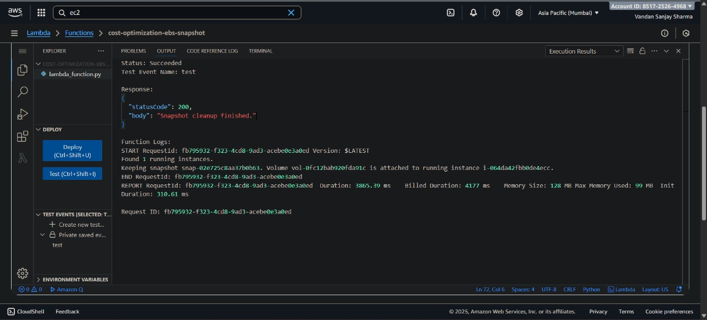
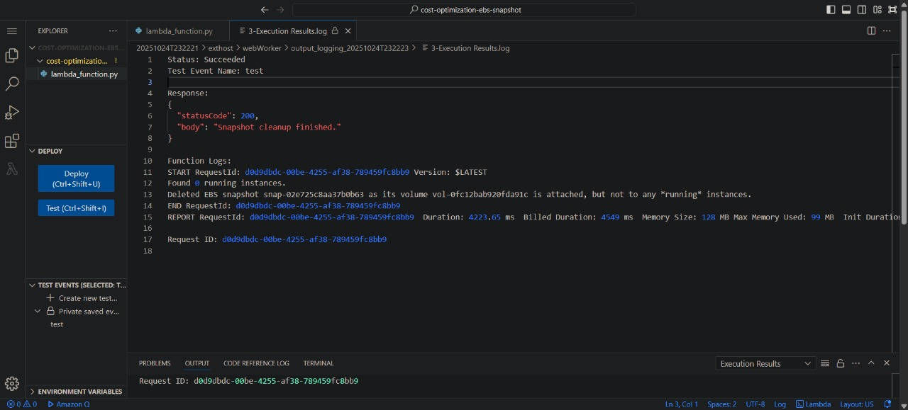

# AWS Cost Optimization Utility: EBS Snapshot Clean-up

This project is a serverless, cost-optimization utility that runs on **AWS Lambda**. It automatically finds and deletes orphaned **EBS snapshots** to reduce monthly AWS costs.

The script is written in **Python 3.12** and uses the **Boto3 SDK** to interact with AWS services.

---

## 🧩 The Problem

EBS snapshots are often created automatically as backups, but when their parent EC2 instance or EBS volume is deleted, the snapshot remains.  
This leads to **"snapshot sprawl"**, where hundreds of old, unused snapshots accumulate, costing money every month.

---

## ⚙️ How It Works

The Lambda function runs and performs the following logic:

1. **Gets All Snapshots:**  
   Fetches a complete list of all EBS snapshots owned by the account.

2. **Gets All *Running* Instances:**  
   Fetches a list of all EC2 instances currently in the `running` state.

3. **Makes a Decision for Each Snapshot:**

   * **KEEP:** If the snapshot's volume is attached to any *running* instance.  
   * **DELETE:** If the snapshot has no `VolumeId` (orphaned).  
   * **DELETE:** If the snapshot's `VolumeId` no longer exists (volume was deleted).  
   * **DELETE:** If the snapshot's volume exists but is "unattached" (not attached to any instance).  
   * **DELETE:** If the snapshot's volume is only attached to a `stopped` instance.

---

## 🧠 Project Architecture

### 1. **The Lambda Function**

The core logic is contained in a single Python file (`lambda_function.py`).  
The function is designed to be run on a schedule (e.g., once a week via **EventBridge Scheduler**).

**Lambda Test Execution Screenshot:**

---

### 2. **IAM Permissions (Security)**

The function runs with a **least-privilege IAM role**.  
An inline policy (`EC2SnapshotCleanupPolicy`) was created by searching for the **EC2 service** and granting the following permissions:

* `ec2:DescribeInstances`  
* `ec2:DescribeSnapshots`  
* `ec2:DescribeVolumes`  
* `ec2:DeleteSnapshot`

**IAM Policy JSON Configuration:**

---

### 3. **IAM Role with Attached Policies**

The Lambda execution role (`cost-optimization-ebs-snapshot-role`) has the following policies attached:

* `AWSLambdaBasicExecutionRole`  
* `EC2SnapshotCleanupPolicy`

**IAM Role Permissions Screenshot:**

---

## ✅ Execution & Proof

The function was tested in the Lambda console.  
The logs show the function successfully identifying a snapshot attached to a running instance and correctly deciding to "Keep" it, proving that the safety logic works perfectly.

**Successful Test Run Output:**

